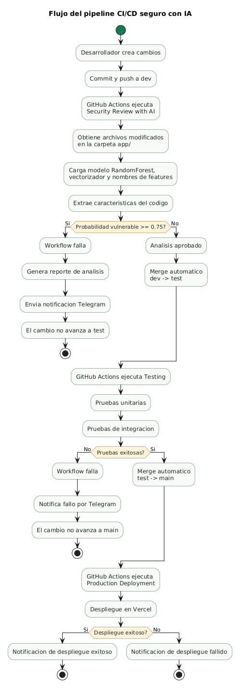

# Pipeline CI/CD Seguro con IA para Deteccion de Vulnerabilidades

## Resumen

Este proyecto implementa un pipeline CI/CD seguro que integra un modelo de mineria de datos para analizar codigo fuente antes de permitir su avance hacia ambientes superiores. El objetivo principal es reducir el riesgo de introducir codigo vulnerable en produccion mediante una revision automatizada basada en aprendizaje automatico, pruebas automatizadas, proteccion de ramas y notificaciones operativas.

La solucion combina:

- Una aplicacion web sencilla en Node.js y Express.
- Un clasificador binario entrenado con scikit-learn para identificar codigo seguro o vulnerable.
- Workflows de GitHub Actions para revision de seguridad, pruebas, promocion entre ramas y despliegue.
- Notificaciones automaticas por Telegram.
- Documentacion de evidencia y scripts auxiliares para proteger ramas.

## Objetivo academico

El proyecto demuestra como integrar tecnicas de mineria de datos dentro de un ciclo DevSecOps. En terminos practicos, cada cambio de codigo pasa por controles automatizados antes de llegar a produccion:

1. Analisis de seguridad con modelo de IA.
2. Ejecucion de pruebas unitarias e integracion.
3. Promocion controlada entre ramas.
4. Despliegue automatizado.
5. Registro de evidencia y notificaciones.

## Tabla de contenidos

- [Arquitectura general](#arquitectura-general)
- [Diagrama de flujo](#diagrama-de-flujo)
- [Estructura del proyecto](#estructura-del-proyecto)
- [Requisitos](#requisitos)
- [Instalacion local](#instalacion-local)
- [Ejecucion de la aplicacion](#ejecucion-de-la-aplicacion)
- [Entrenamiento y evaluacion del modelo](#entrenamiento-y-evaluacion-del-modelo)
- [Inferencia manual](#inferencia-manual)
- [Funcionamiento del pipeline CI/CD](#funcionamiento-del-pipeline-cicd)
- [Configuracion de GitHub](#configuracion-de-github)
- [Proteccion de ramas](#proteccion-de-ramas)
- [Despliegue en Vercel](#despliegue-en-vercel)
- [Metricas actuales del modelo](#metricas-actuales-del-modelo)
- [Guia de replicacion](#guia-de-replicacion)
- [Referencias](#referencias)

## Arquitectura general

La arquitectura se divide en cuatro capas:

| Capa | Responsabilidad | Componentes |
| --- | --- | --- |
| Aplicacion | Expone una interfaz web y endpoints de salud/estado | `app/`, `api/` |
| Modelo de IA | Extrae caracteristicas del codigo y clasifica vulnerabilidad | `models/`, `scripts/feature_engineering/`, `scripts/training/`, `scripts/inference/` |
| CI/CD | Automatiza revision, pruebas, promocion y despliegue | `.github/workflows/` |
| Evidencia y gobierno | Documenta resultados, proteccion de ramas y entrega | `reports/`, `docs/`, `.github/branch-protection.md` |

## Diagrama de flujo



El archivo editable del diagrama se encuentra en:

```text
docs/diagrams/pipeline-flow.puml
```

## Estructura del proyecto

```text
.
|-- .github/
|   |-- branch-protection.md
|   `-- workflows/
|       |-- deploy.yml
|       |-- security-review.yml
|       `-- tests.yml
|-- api/
|   `-- index.js
|-- app/
|   |-- app.js
|   |-- package.json
|   |-- package-lock.json
|   |-- server.js
|   `-- test/
|       `-- index.test.js
|-- datasets/
|   |-- secure_programming_dpo.json
|   `-- secure_programming_dpo_clean.json
|-- docs/
|   `-- evidence.md
|-- models/
|   |-- feature_names.joblib
|   |-- security_classifier.joblib
|   `-- vectorizer.joblib
|-- reports/
|   |-- data_quality_report.md
|   |-- dataset_analysis_report.md
|   `-- evaluation_report.md
|-- scripts/
|   |-- analysis/
|   |-- ci_cd/
|   |-- evaluation/
|   |-- feature_engineering/
|   |-- inference/
|   |-- preprocessing/
|   `-- training/
|-- requirements.txt
|-- vercel.json
`-- README.md
```

## Requisitos

Para ejecutar y replicar el proyecto se requiere:

- Git.
- Python 3.10 o superior.
- Node.js 20 o superior.
- npm.
- Cuenta de GitHub con permisos sobre el repositorio.
- Cuenta de Vercel para el despliegue.
- Bot de Telegram para notificaciones.

## Instalacion local

1. Clonar el repositorio:

```bash
git clone https://github.com/BrayanJac/ModeloIA_DeteccionCodigoSeguro.git
cd ModeloIA_DeteccionCodigoSeguro
```

2. Crear y activar un entorno virtual de Python:

```bash
python -m venv venv
source venv/bin/activate
```

En Windows:

```bash
venv\Scripts\activate
```

3. Instalar dependencias de Python:

```bash
pip install -r requirements.txt
```

4. Instalar dependencias de la aplicacion Node.js:

```bash
cd app
npm install
cd ..
```

## Ejecucion de la aplicacion

La aplicacion principal es un dashboard sencillo que resume el estado del pipeline, las metricas del modelo y los controles implementados.

Para ejecutarla localmente:

```bash
cd app
npm start
```

Luego abrir:

```text
http://localhost:3000
```

Endpoints disponibles:

| Endpoint | Descripcion |
| --- | --- |
| `/` | Dashboard web del proyecto |
| `/health` | Verificacion de salud de la API |
| `/api/status` | Estado del pipeline en formato JSON |

Para ejecutar las pruebas de la aplicacion:

```bash
cd app
npm test
```

## Entrenamiento y evaluacion del modelo

### 1. Analisis y limpieza del dataset

Antes de entrenar el modelo se recomienda revisar la calidad del dataset:

```bash
python scripts/analysis/analyze_dataset.py
python scripts/analysis/clean_dataset.py
```

Estos comandos generan reportes en `reports/` y, si corresponde, una version limpia del dataset en `datasets/`.

### 2. Entrenamiento

```bash
python scripts/training/train.py
```

El entrenamiento utiliza un `RandomForestClassifier` de scikit-learn y combina caracteristicas TF-IDF con caracteristicas manuales del codigo. Entre las caracteristicas manuales se incluyen funciones peligrosas, senales de sanitizacion, metricas estructurales y profundidad aproximada o real del AST (`ast_depth`).

Archivos generados o actualizados:

- `models/security_classifier.joblib`
- `models/vectorizer.joblib`
- `models/feature_names.joblib`
- `reports/evaluation_report.md`

### 3. Evaluacion

```bash
python scripts/evaluation/evaluate.py
```

La evaluacion permite revisar metricas como accuracy, precision, recall, F1-score y AUC-ROC.

## Inferencia manual

Para analizar codigo desde la terminal:

```bash
python scripts/inference/predict.py --code "print('hola')"
```

Para analizar un archivo:

```bash
python scripts/inference/predict.py --file ruta/al/archivo.py
```

Para cambiar el umbral de decision:

```bash
python scripts/inference/predict.py --file ruta/al/archivo.py --threshold 0.75
```

Interpretacion general:

- `0`: codigo clasificado como seguro.
- `1`: codigo clasificado como vulnerable.
- Probabilidad vulnerable mayor o igual al umbral: el cambio se considera riesgoso.

## Funcionamiento del pipeline CI/CD

El proyecto utiliza tres workflows principales.

### 1. Revision de seguridad: `security-review.yml`

Se ejecuta cuando hay un `push` a la rama `dev`.

Responsabilidades:

- Instalar dependencias de Python.
- Verificar que existan los archivos del modelo entrenado.
- Obtener archivos modificados dentro de `app/`.
- Ejecutar `scripts/ci_cd/analyze_pr.py`.
- Evaluar cada archivo con el modelo de IA.
- Generar `reports/analysis_result.json` y `reports/pr_comment.md`.
- Enviar notificaciones por Telegram.
- Detener el flujo si se detecta codigo vulnerable.
- Promover automaticamente cambios seguros de `dev` hacia `test`.

El umbral actual de vulnerabilidad es:

```text
0.75
```

Esto significa que un archivo con probabilidad de vulnerabilidad mayor o igual a 75% bloquea el avance.

### 2. Pruebas y promocion: `tests.yml`

Se ejecuta cuando hay un `push` a `test` y tambien ante Pull Requests hacia `main`.

Responsabilidades:

- Instalar dependencias Node.js.
- Ejecutar pruebas unitarias.
- Ejecutar pruebas de integracion.
- Notificar el resultado por Telegram.
- Bloquear el avance si alguna prueba falla.
- Promover automaticamente cambios exitosos de `test` hacia `main`.

### 3. Despliegue: `deploy.yml`

Se ejecuta cuando hay un `push` a `main`.

Responsabilidades:

- Preparar el entorno del workflow.
- Ejecutar despliegue productivo en Vercel.
- Enviar notificacion de exito o fallo por Telegram.

## Configuracion de GitHub

Para que el pipeline funcione, se deben configurar los siguientes secretos en GitHub:

| Secret | Uso |
| --- | --- |
| `PAT_TOKEN` | Token personal usado por GitHub Actions para realizar merges automaticos entre ramas |
| `TELEGRAM_BOT_TOKEN` | Token del bot de Telegram |
| `TELEGRAM_CHAT_ID` | Identificador del chat donde se enviaran las notificaciones |
| `VERCEL_TOKEN` | Token de Vercel para ejecutar despliegues |
| `VERCEL_ORG_ID` | Identificador de la organizacion o cuenta en Vercel |
| `VERCEL_PROJECT_ID` | Identificador del proyecto en Vercel |

Permisos minimos recomendados para el `PAT_TOKEN`:

- Acceso al repositorio.
- Permiso de lectura y escritura de contenido.
- Permiso para interactuar con Pull Requests, si se usa revision manual adicional.
- Capacidad de hacer push a ramas protegidas solo para el usuario o bot autorizado.

## Proteccion de ramas

El proyecto incluye el script:

```text
scripts/ci_cd/configure_branch_protection.py
```

Este script aplica o verifica reglas de proteccion sobre las ramas `dev`, `test` y `main`.

Ejecutar verificacion:

```bash
GH_ADMIN_TOKEN=token_con_permisos_admin \
python scripts/ci_cd/configure_branch_protection.py --verify-only
```

Aplicar proteccion:

```bash
GH_ADMIN_TOKEN=token_con_permisos_admin \
python scripts/ci_cd/configure_branch_protection.py
```

La proteccion configurada busca:

- Evitar force push.
- Evitar eliminacion de ramas.
- Exigir revisiones por Pull Request.
- Exigir checks obligatorios segun la rama.
- Aplicar reglas tambien a administradores.

Nota importante: las reglas de proteccion requieren permisos de administrador sobre el repositorio. Si el token no tiene esos permisos, GitHub rechazara la configuracion.

## Despliegue en Vercel

El proyecto se despliega desde `main` usando Vercel.

Archivo de configuracion:

```text
vercel.json
```

Entrada serverless:

```text
api/index.js
```

La aplicacion Express se exporta desde `app/app.js` y Vercel redirige las rutas hacia `api/index.js`.

## Metricas actuales del modelo

Segun `reports/evaluation_report.md`, las metricas actuales son:

| Metrica | Valor |
| --- | ---: |
| Accuracy | 0.8268 |
| Precision | 0.8271 |
| Recall | 0.8213 |
| F1-score | 0.8242 |
| AUC-ROC | 0.9142 |

Matriz de confusion:

```text
[734 148]
[154 708]
```

Interpretacion:

- 734 casos seguros fueron clasificados correctamente como seguros.
- 708 casos vulnerables fueron clasificados correctamente como vulnerables.
- 148 casos seguros fueron marcados como vulnerables.
- 154 casos vulnerables fueron marcados como seguros.

## Caracteristicas del modelo

El modelo combina dos grupos de caracteristicas.

### Caracteristicas TF-IDF

- Tokens del codigo fuente.
- N-gramas de 1 a 2 terminos.
- Maximo de 3000 caracteristicas textuales.

### Caracteristicas manuales

Incluyen, entre otras:

- Conteo de lineas.
- Conteo de tokens.
- Longitud del codigo.
- Numero de llamadas a funciones.
- Uso de funciones peligrosas como `eval`, `exec`, `os.system`, `subprocess`, `shell=True`.
- Uso de funciones de sanitizacion como `sanitize`, `escape`, `htmlspecialchars`, `prepareStatement`.
- Patrones de SQL crudo.
- Relacion entre sanitizacion y funciones peligrosas.
- Profundidad del arbol de sintaxis abstracta mediante `ast_depth`.

## Guia de replicacion

Para replicar el proyecto desde cero:

1. Clonar el repositorio.
2. Instalar dependencias Python con `pip install -r requirements.txt`.
3. Instalar dependencias Node.js con `npm install` dentro de `app/`.
4. Ejecutar `npm test` dentro de `app/` para validar la aplicacion.
5. Ejecutar los scripts de analisis y limpieza del dataset.
6. Entrenar el modelo con `python scripts/training/train.py`.
7. Confirmar que existan los archivos `.joblib` dentro de `models/`.
8. Configurar los secrets en GitHub.
9. Configurar la proteccion de ramas con un token administrador.
10. Hacer cambios en `dev` para activar el analisis de seguridad.
11. Verificar que el flujo avance automaticamente a `test`, luego a `main` y finalmente a Vercel si todos los controles pasan.

## Evidencia del proyecto

La evidencia principal se encuentra en:

```text
docs/evidence.md
reports/evaluation_report.md
reports/dataset_analysis_report.md
reports/data_quality_report.md
```

Tambien se puede revisar el dashboard local en `/` y el estado JSON en `/api/status`.

## Limitaciones

- El modelo es una aproximacion estadistica; no reemplaza una auditoria manual ni herramientas SAST especializadas.
- El rendimiento depende de la calidad y representatividad del dataset.
- El umbral de 0.75 puede ajustarse segun el balance deseado entre falsos positivos y falsos negativos.
- La proteccion efectiva contra push directo depende de que las reglas de ramas esten aplicadas en GitHub con permisos administrativos.

## Referencias

- Dataset base: https://huggingface.co/datasets/CyberNative/Code_Vulnerability_Security_DPO
- scikit-learn: https://scikit-learn.org/
- GitHub Actions: https://docs.github.com/actions
- Vercel: https://vercel.com/docs
- OWASP Top 10: https://owasp.org/www-project-top-ten/

## Autor

Proyecto desarrollado por el Grupo 4.
